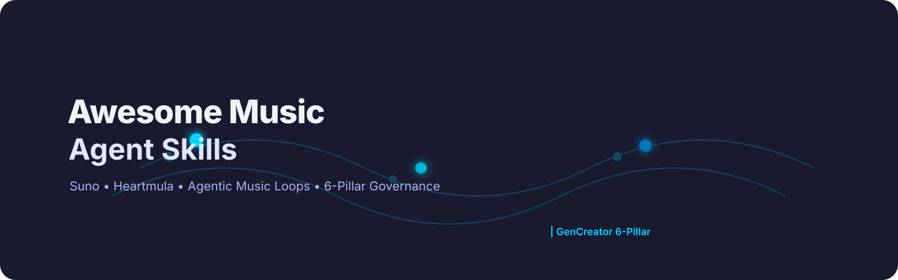
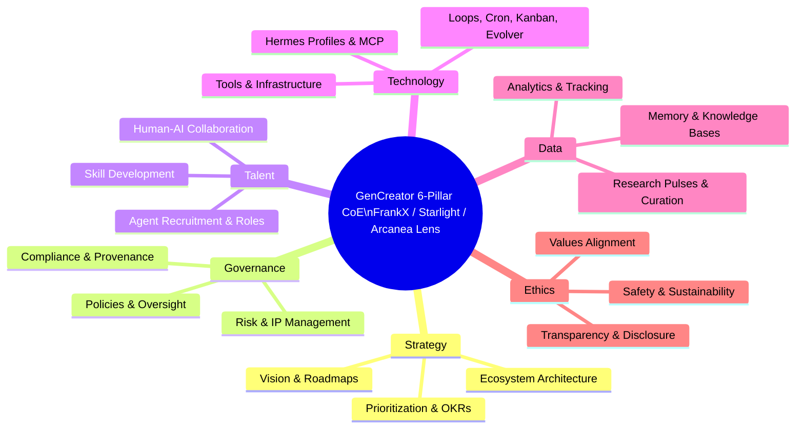

  

<h1 align="center">Awesome Music Agent Skills</h1>

  <strong>Curated through the GenCreator 6-Pillar CoE lens • Starlight Swarm • Arcanea Creative Execution • Agentic Passive Income Systems</strong>

  <a href="#contents">Contents</a> ·
  <a href="#6-pillar-mapping">6-Pillar Mapping</a> ·
  <a href="#explore-the-full-frankx-awesome-ecosystem-17-lists">Full Ecosystem (17)</a> ·
  <a href="#contributing">Contribute</a>

> **THE definitive curated resource for music-agent-skills** — Suno, Heartmula, stem separation, MIR, transcription, recommendation, MCP servers, agentic music loops, and income-generating creative agents. Independent index with 6-Pillar governance, provenance, and agentic passive income angles.

This list fills the gap between generic music AI lists and sovereign, local-first, 6-Pillar-aligned agent skills that compound into real creative income systems.

## Why This List Exists
- Bridges creative execution (Arcanea) with agentic income (agentic-passive-income skill)
- Emphasizes local MCP, skills as plugins, recurring loops (cron/kanban/evolver)
- Prioritizes tools with provenance, safety, and multi-agent orchestration potential
- Cross-links to gstack skills, suno-e2e-workflow, heartmula, and the full 17 awesome-* suite

## Contents
- [Top Picks](#top-picks)
- [Music Generation](#music-generation)
- [Music Analysis & MIR](#music-analysis--mir)
- [Transcription & Score Recognition](#transcription--score-recognition)
- [Stem Separation & Source Separation](#stem-separation--source-separation)
- [Music Recommendation & Discovery](#music-recommendation--discovery)
- [MCP Servers & Agent Skills](#mcp-servers--agent-skills)
- [Agentic Passive Income & Loops](#agentic-passive-income--loops)
- [6-Pillar Mapping](#6-pillar-mapping)
- [Explore the Full FrankX Awesome Ecosystem (17+ Lists)](#explore-the-full-frankx-awesome-ecosystem-17-lists)
- [Contributing](#contributing)

## Top Picks
| Category | Recommended | 6-Pillar Fit | Clone / Load |
|----------|-------------|--------------|--------------|
| Generation | Suno + heartmula | Creative + Income | Load suno-e2e-workflow |
| Analysis | librosa + Essentia | Technology + Data | `pip install librosa essentia` |
| Separation | Demucs / Spleeter | Technology | `pip install demucs` |
| Agentic | gstack music skills | All pillars | See gstack/ |

## Music Generation
AI-powered tools and models for generating music from text, MIDI, or other inputs. Ties directly to Arcanea creative execution and agentic income via Suno/Heartmula loops.

- **[Suno AI](https://suno.com)** – Text-to-music generator producing full songs with vocals; leading platform for high-quality, instant track creation. *Agentic: Use with suno-e2e-workflow for full pipeline automation.*
- **[Udio](https://www.udio.com)** – Studio-quality AI music generation with detailed style and genre control.
- **[AIVA](https://www.aiva.ai)** – AI composer focused on orchestral and cinematic music; supports MIDI export and DAW integration.
- **[Boomy](https://boomy.com)** – Quick music generation and publishing; beginner-friendly with commercial distribution.
- **[Soundraw](https://soundraw.io)** – Royalty-free AI music generation by mood, genre, and length.
- **[Mubert](https://mubert.com)** – Generative streaming music via API.
- **[Riffusion](https://github.com/riffusion/riffusion)** — Real-time music generation using stable diffusion on spectrogram images. `Python`
- **[Audiocraft / MusicGen](https://github.com/facebookresearch/audiocraft)** — Meta's open-source framework including MusicGen. `Python`
- **[YuE](https://github.com/multimodal-art-projection/YuE)** — Open foundation model for full-song generation from lyrics and style prompts.
- **[ElevenLabs Music](https://elevenlabs.io/music)** — High-quality modular AI music and sound design.
- **Heartmula** – (from creative skill) Suno-like song generation from lyrics + tags. Load via `skill_view(name='heartmula')`
- **suno-e2e-workflow** – End-to-end AI song creation, cover art, video, packaging. Integrates with agentic-passive-income.

## Music Analysis & MIR
- **[librosa](https://github.com/librosa/librosa)** — The de-facto Python library for audio analysis: MFCCs, chroma, beat tracking... `Python`
- **[Essentia](https://github.com/MTG/essentia)** — C++/Python library for comprehensive audio analysis and MIR. `C++` `Python`
- **[Sonoteller](https://sonoteller.ai)** — Cloud API for deep song analysis: mood, genre, tempo...
- **[Cyanite](https://cyanite.ai)** — AI-powered music analysis and similarity search API.
- **[madmom](https://github.com/CPJKU/madmom)** — Python audio and music signal processing library. `Python`
- **[aubio](https://github.com/aubio/aubio)** — C library with Python bindings for onset detection, pitch tracking... `C` `Python`

## Transcription & Score Recognition
- **[Basic Pitch](https://github.com/spotify/basic-pitch)** — Spotify's lightweight, open-source audio-to-MIDI transcription model. `Python` `JavaScript`
- **[Piano Transcription](https://github.com/bytedance/piano_transcription)** — ByteDance high-quality piano audio-to-MIDI. `Python`
- **[Omnizart](https://github.com/Music-and-Culture-Technology-Lab/omnizart)** — Omnidirectional music transcription library. `Python`
- **[Oemer](https://github.com/BreezeWhite/oemer)** — End-to-end optical music recognition (OMR). `Python`
- **[music21](https://github.com/cuthbertLab/music21)** — MIT toolkit for computational musicology. `Python`

## Stem Separation & Source Separation
- **[Demucs](https://github.com/facebookresearch/demucs)** — Meta's state-of-the-art waveform-based source separation model (4–6 stems). `Python`
- **[Spleeter](https://github.com/deezer/spleeter)** — Deezer's fast 2/4/5-stem separator. `Python`
- **[Open-Unmix (UMX)](https://github.com/sigsep/open-unmix-pytorch)** — Reference implementation for music source separation. `Python`
- **[LALAL.AI](https://www.lalal.ai)** — Commercial cloud service for high-quality stem separation.
- **[AudioSep](https://github.com/Audio-AGI/AudioSep)** — Universal sound separation guided by natural language queries. `Python`

## Music Recommendation & Discovery
- **[Cyanite](https://cyanite.ai)** — Semantic music similarity search API.
- **[Sonoteller](https://sonoteller.ai)** — Deep audio analysis with mood, genre, energy tagging.
- **[AudD](https://audd.io)** — Music recognition (like Shazam) API.
- **[Acoustid](https://acoustid.org)** — Open-source audio fingerprinting API.
- **[Beets](https://github.com/beetbox/beets)** — Extensible music library manager. `Python`
- **[spotipy](https://github.com/spotipy-dev/spotipy)** — Lightweight Python wrapper for the Spotify Web API. `Python`

## MCP Servers & Agent Skills
- **gstack music skills** – High-quality reusable skills from gstack (see skill search for SKILL.md in gstack). Load examples: skill_view(name='gstack-*')
- Integrate with Hermes profiles for local music agent fleets.
- **heartmula** and **suno-e2e-workflow** as core agent skills for music generation loops.

## Agentic Passive Income & Loops
Tie music agents to recurring income via agentic-passive-income skill:
- Automated Suno track generation + distribution pipelines
- Playlist curation agents monetized via streaming
- Custom music skill marketplaces
- Load: skill_view(name='agentic-passive-income')

## 6-Pillar Mapping

**Usage**: Music agents excel in Technology (MCP, loops), Creative/Arcanea execution, and Income pillar via agentic-passive-income integration. Governance ensures provenance of generated tracks.

## Explore the Full FrankX Awesome Ecosystem (17+ Lists)
Curated through the GenCreator 6-Pillar CoE lens • Starlight Swarm • Arcanea Creative Execution • Agentic Passive Income Systems

- [awesome-jarvis](https://github.com/frankxai/awesome-jarvis) (private - Jarvis meta-orchestrator)
- [awesome-manifestation-skills](https://github.com/frankxai/awesome-manifestation-skills)
- [awesome-agentic-income](https://github.com/frankxai/awesome-agentic-income)
- [awesome-hermes-agents](https://github.com/frankxai/awesome-hermes-agents) (reference for Hermes fleets)
- [awesome-ai-coe](https://github.com/frankxai/awesome-ai-coe)
- [awesome-design-agent-skills](https://github.com/frankxai/awesome-design-agent-skills)
- [awesome-music-agent-skills](https://github.com/frankxai/awesome-music-agent-skills) ← You are here
- [awesome-agent-operating-systems](https://github.com/frankxai/awesome-agent-operating-systems) (reference pattern with hero, validate, docs/)
- [awesome-hermes-agent-skills](https://github.com/frankxai/awesome-hermes-agent-skills)
- [awesome-wealth-agent-skills](https://github.com/frankxai/awesome-wealth-agent-skills)
- [awesome-gamification-agent-skills](https://github.com/frankxai/awesome-gamification-agent-skills)
- [awesome-investor-agent-skills](https://github.com/frankxai/awesome-investor-agent-skills)
- [awesome-automation-agent-skills](https://github.com/frankxai/awesome-automation-agent-skills)
- [awesome-cosmos-ai-agents](https://github.com/frankxai/awesome-cosmos-ai-agents)
- [awesome-mind-agent-skills](https://github.com/frankxai/awesome-mind-agent-skills)
- [awesome-payment-agent-skills](https://github.com/frankxai/awesome-payment-agent-skills)
- [awesome-motion-design-agent-skills](https://github.com/frankxai/awesome-motion-design-agent-skills)

**Additional discovered**: awesome-suno-agent-skills, and local batch3-awesome/* , mind-intelligence-swarm/*

## Contributing
Please read [CONTRIBUTING.md](CONTRIBUTING.md) and the provenance rules in [awesome-hermes-agents/docs/provenance-and-naming.md](https://github.com/frankxai/awesome-hermes-agents/blob/main/docs/provenance-and-naming.md).

- New entries must include 6-Pillar Fit note and source link.
- Prefer primary GitHub repos and active projects.
- For music-specific: link to suno-e2e, heartmula, gstack skills where applicable.
- Use the issue templates in `.github/ISSUE_TEMPLATE/`

**Maintenance**: Updated via awesome-list-maintenance skill + gencreator-swarm-evolver. Last research pulse: 2026-07-01

**License**: CC0 / MIT where applicable. This is an independent curation.

---

*Elevated with patched template: mermaid 6-pillar, 17-list cross links, hero.svg, .github/ standards, gh topics/description. Verified with gh/git.*
